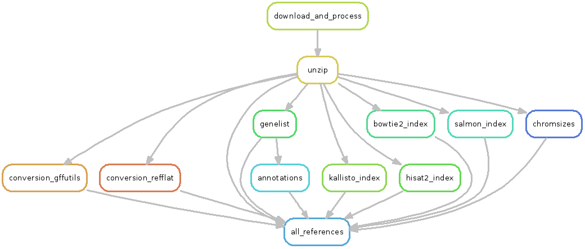
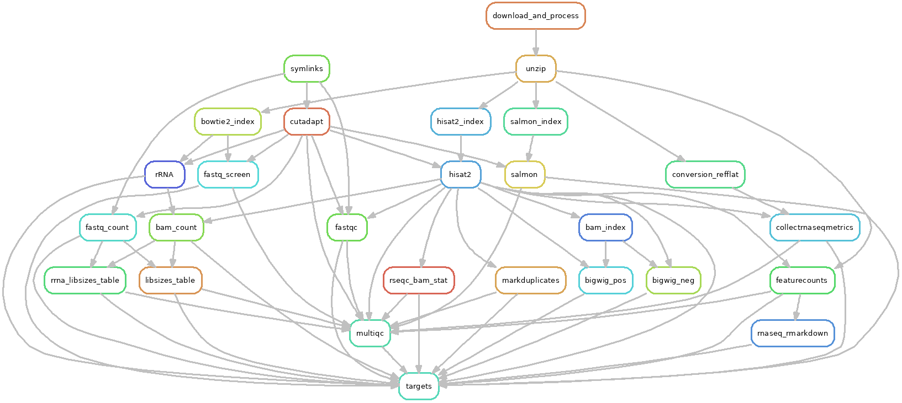

# `lcdb-wf`

A collection of [snakemake](https://snakemake.readthedocs.io/en/stable/)
workflows and tools for common high-throughput sequencing analysis, along with
associated infrastructure.

See docs at https://lcdb.github.io/lcdb-wf.

## References workflow

DAG for references workflow:

## RNA-seq workflow

DAG for RNA-seq workflow:

