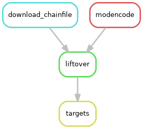

.. _external:

"External" workflow
-------------------
This workflow is a working example downloads some data from modENCODE in an
older fly genome assembly (dm3), fixes the formatting so they can be lifted
over, and lifts over the files to the newer dm6 assembly.

It can be used as a template for integrative downstream work, as a place to
keep track and automate the download and preparation of external published
data. It can then be incorporated into the ``figures`` workflow (described
below) to integrate the analysis with other output.

