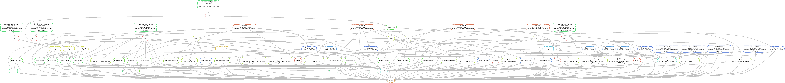

.. _rnaseq:

RNA-seq workflow
================

This workflow is used for RNA-seq and RNA-seq-like analysis (like euRNA-seq,
RIP-seq or small RNA-seq).

This workflow can use references created by the references workflow with no
need to run the references workflow separately. This workflow performs the
following tasks:

- Build a HISAT2 index
- Build a salmon transcriptome index
- Download a GTF annotation
- Convert the GTF to refflat format
- Trim reads with cutadapt
- Align with HISAT2
- Run FastQC on raw, trimmed, and aligned reads
- Align reads to rRNA using bowtie2 to evaluate rRNA contamination
- Count reads in genes with featureCounts
- Run dupRadar and preseq to assess library complexity
- Check for evidence of cross-contamination using fastq_screen on multiple
  configured genomes
- Assess transcript coverage with Picard CollectRnaSeqMetrics
- Build bigWigs (optionally strand-specific) created from BAM files
- Optionally merge bigWigs as defined by config
- Aggregate QC results using MultiQC. Includes custom tables for library
  sizes and rRNA contamination
- Run comprehensive downstream analysis including QC and differential expression
  in R. See section below for more details.
- Construct and upload a track hub of scaled coverage bigWigs for each
  sample that can be viewed in UCSC Genome Browser

The DAG of jobs looks like this:

Downstream analysis
~~~~~~~~~~~~~~~~~~~

This is  performed in an RMarkdown file (``rnaseq.Rmd``) that uses DESeq2
for differential expression analysis, along with diagnostic plots, 
exported tables of differentially expressed genes for each comparison of 
interest, gene patterns analysis for finding coexpressed genes and downstream
functional enrichment analysis using clusterProfiler. This file is run and
rendered into an output HTML file. See :ref:`downstream` for more details.

.. toctree::
   :maxdepth: 2

   downstream-rnaseq

